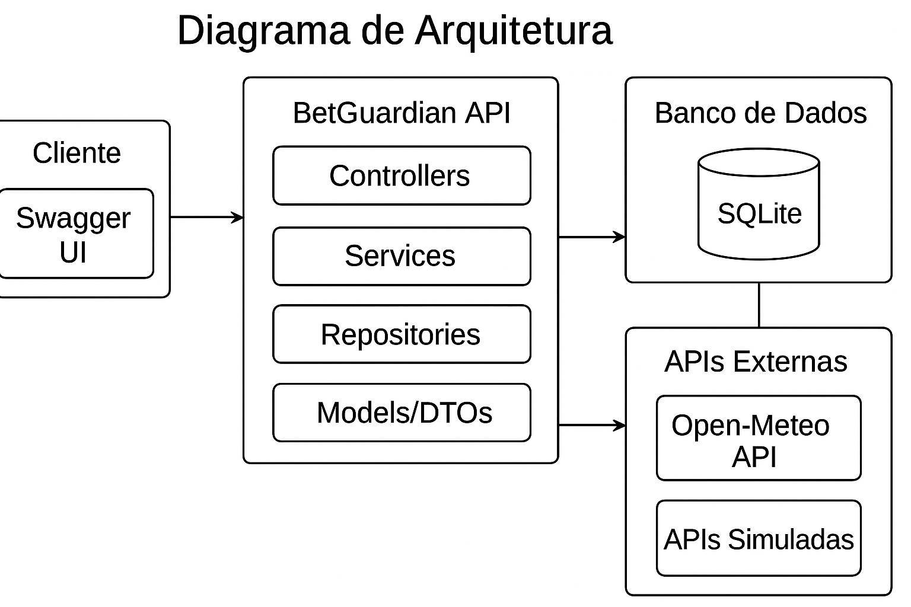
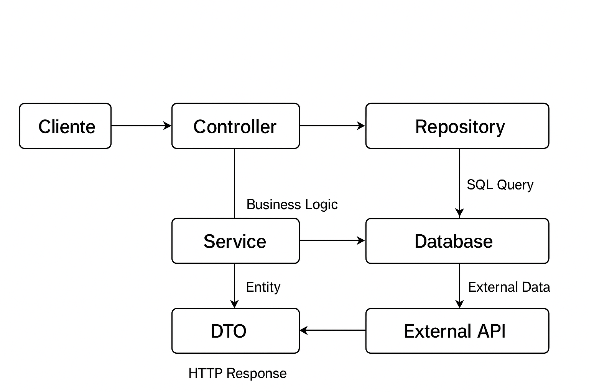
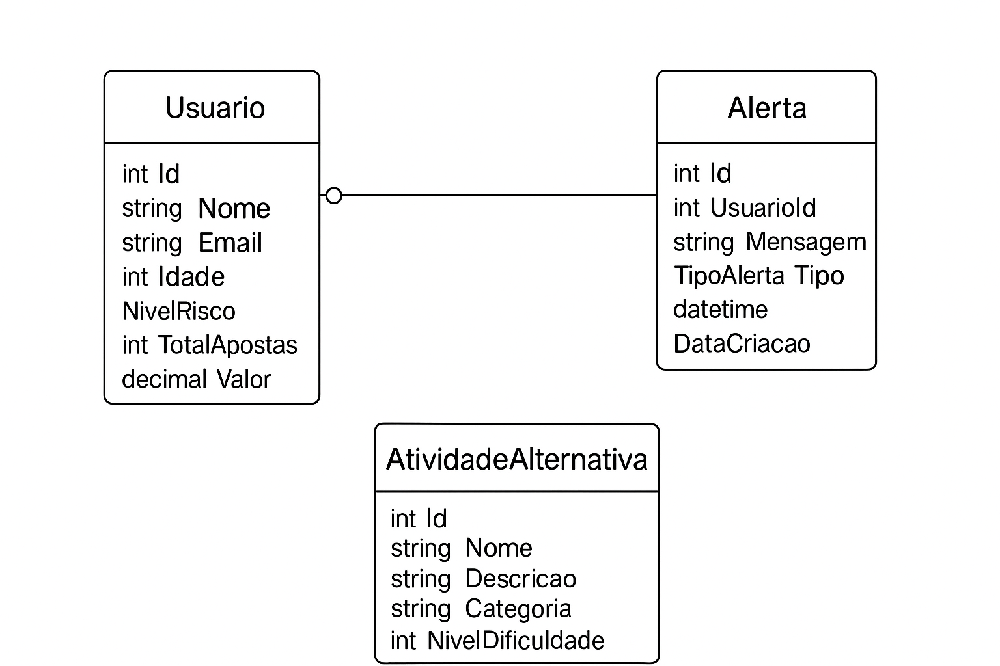

# BetGuardian API

## 📋 Descrição do Projeto

Este projeto implementa uma API para detectar e notificar comportamentos de aposta compulsiva. A ideia é exemplificar técnicas de identificação de risco e oferecer alternativas saudáveis para os usuários.

Nós desenvolvemos o sistema como parte da Sprint 4 da disciplina de C# Software Development da FIAP. O foco está em criar uma ferramenta que ajude pessoas a reconhecerem padrões problemáticos em suas apostas.

### 🎯 O que o sistema faz

O BetGuardian funciona assim:

- Monitora o comportamento de apostas dos usuários
- Calcula automaticamente o nível de risco baseado nos gastos e frequência
- Gera alertas personalizados e mensagens motivacionais
- Sugere atividades alternativas para substituir as apostas
- Integra com APIs externas para trazer informações úteis
- Oferece uma base para intervenções preventivas

### 👥 Integrantes do Grupo

- **550161** - EDUARDO OSORIO FILHO
- **550610** - FABIO HIDEKI KAMIKIHARA  
- **550260** - PEDRO MOURA BARROS
- **98896** - RODRIGO FERNANDES DOS SANTOS

## 🏗️ Como o sistema está organizado

### Padrões que usamos

- **Repository Pattern**: Para organizar o acesso aos dados
- **Service Layer**: Para colocar a lógica de negócio
- **DTO Pattern**: Para transferir dados entre as camadas
- **Dependency Injection**: Para conectar as partes do sistema
- **SOLID Principles**: Para manter o código limpo e organizado

### Estrutura de Camadas

```
BetGuardianAPI/
├── Controllers/          # Controladores da API
├── Services/            # Lógica de negócio
├── Repositories/        # Acesso a dados
├── Models/              # Entidades do domínio
├── DTOs/                # Objetos de transferência
├── Data/                # Contexto do Entity Framework
└── Program.cs           # Configuração da aplicação
```

### Diagrama de Arquitetura



### Fluxo de Dados



## 🗄️ Modelo de Dados

### Diagrama de Entidades



### Entidades Principais

#### Usuario
- **Id**: Identificador único
- **Nome**: Nome completo do usuário
- **Email**: Email único do usuário
- **Idade**: Idade do usuário (18-100 anos)
- **NivelRisco**: Nível de risco calculado (Baixo, Medio, Alto, Critico)
- **TotalApostas**: Número total de apostas realizadas
- **ValorGasto**: Valor total gasto em apostas

#### Alerta
- **Id**: Identificador único
- **UsuarioId**: Referência ao usuário
- **Mensagem**: Conteúdo do alerta
- **Tipo**: Tipo do alerta (Informativo, Aviso, Critico, Motivacional)
- **DataCriacao**: Data e hora de criação

#### AtividadeAlternativa
- **Id**: Identificador único
- **Nome**: Nome da atividade
- **Descricao**: Descrição detalhada
- **Categoria**: Categoria da atividade
- **NivelDificuldade**: Nível de dificuldade (1-5)
- **TempoEstimadoMinutos**: Tempo estimado em minutos

## 🚀 Como Executar o Sistema

### Pré-requisitos

- [.NET 8.0 SDK](https://dotnet.microsoft.com/download/dotnet/8.0)
- Visual Studio 2022 ou VS Code
- Git

### ⚙️ Como rodar o projeto

1. **Baixe o código**
   ```bash
   git clone <url-do-repositorio>
   cd BetGuardianAPI
   ```

2. **Instale as dependências**
   ```bash
   dotnet restore
   ```

3. **Compile o projeto**
   ```bash
   dotnet build
   ```

4. **Execute a API**
   ```bash
   dotnet run
   ```

5. **Abra o Swagger**
   - Acesse: `https://localhost:7000` ou `http://localhost:5000`
   - A documentação da API vai abrir automaticamente

### 🧪 Como rodar os testes

```bash
dotnet test
```

Nós criamos testes para garantir que tudo funciona. O comando acima roda todos os testes automaticamente.

### 💾 Como criar o banco de dados

```bash
# Instalar ferramentas do Entity Framework (se necessário)
dotnet tool install --global dotnet-ef

# Criar migration inicial
dotnet ef migrations add InitialCreate

# Aplicar migrations ao banco
dotnet ef database update
```

O banco é criado automaticamente quando você roda o projeto, mas esses comandos são úteis se você quiser recriar tudo do zero.

### Configuração do Banco de Dados

O sistema utiliza SQLite como banco de dados padrão. O banco é criado automaticamente na primeira execução e populado com dados de exemplo.

**Arquivos de banco:**
- Desenvolvimento: `BetGuardian_Dev.db`
- Produção: `BetGuardian_Prod.db`

### 🔑 Como usar o token JWT no Swagger

1. **Registrar um usuário:**
   - Vá no endpoint `POST /api/auth/register`
   - Preencha: nome, email, idade e senha
   - Execute a requisição

2. **Fazer login:**
   - Vá no endpoint `POST /api/auth/login`
   - Use o email e senha que você cadastrou
   - Copie o token que aparece na resposta

3. **Usar o token:**
   - Clique no botão "Authorize" no topo do Swagger
   - Cole o token no campo "Value" (formato: `Bearer SEU_TOKEN_AQUI`)
   - Clique em "Authorize"
   - Pronto! Agora você pode acessar todos os endpoints

**Usuários de exemplo (senha: 123456):**
- joao.silva@email.com
- maria.santos@email.com
- pedro.oliveira@email.com
- ana.costa@email.com
- carlos.ferreira@email.com

## 📚 Endpoints da API

### Autenticação (`/api/auth`)

| Método | Endpoint | Descrição |
|--------|----------|-----------|
| POST | `/api/auth/register` | Registra novo usuário |
| POST | `/api/auth/login` | Realiza login e retorna token JWT |
| GET | `/api/auth/validate` | Valida token JWT (protegido) |

### Usuários (`/api/usuarios`)

| Método | Endpoint | Descrição |
|--------|----------|-----------|
| GET | `/api/usuarios` | Lista todos os usuários |
| GET | `/api/usuarios/{id}` | Obtém usuário por ID |
| POST | `/api/usuarios` | Cria novo usuário |
| PUT | `/api/usuarios/{id}` | Atualiza usuário |
| DELETE | `/api/usuarios/{id}` | Remove usuário |
| GET | `/api/usuarios/{id}/analise-risco` | Analisa risco do usuário |
| GET | `/api/usuarios/maior-risco` | Lista usuários de maior risco |
| GET | `/api/usuarios/por-nivel-risco/{nivel}` | Lista usuários por nível de risco |

### Alertas (`/api/alertas`)

| Método | Endpoint | Descrição |
|--------|----------|-----------|
| GET | `/api/alertas` | Lista todos os alertas |
| GET | `/api/alertas/{id}` | Obtém alerta por ID |
| POST | `/api/alertas` | Cria novo alerta |
| PUT | `/api/alertas/{id}` | Atualiza alerta |
| DELETE | `/api/alertas/{id}` | Remove alerta |
| GET | `/api/alertas/usuario/{usuarioId}` | Lista alertas do usuário |
| GET | `/api/alertas/tipo/{tipo}` | Lista alertas por tipo |
| GET | `/api/alertas/recentes` | Lista alertas recentes |

### Atividades Alternativas (`/api/atividadesalternativas`)

| Método | Endpoint | Descrição |
|--------|----------|-----------|
| GET | `/api/atividadesalternativas` | Lista todas as atividades |
| GET | `/api/atividadesalternativas/{id}` | Obtém atividade por ID |
| POST | `/api/atividadesalternativas` | Cria nova atividade |
| PUT | `/api/atividadesalternativas/{id}` | Atualiza atividade |
| DELETE | `/api/atividadesalternativas/{id}` | Remove atividade |
| GET | `/api/atividadesalternativas/categoria/{categoria}` | Lista por categoria |
| GET | `/api/atividadesalternativas/dificuldade/{nivel}` | Lista por dificuldade |
| GET | `/api/atividadesalternativas/sugestao/{usuarioId}` | Sugestões para usuário |

### APIs Externas (`/api/externalapi`)

| Método | Endpoint | Descrição |
|--------|----------|-----------|
| GET | `/api/externalapi/mensagem-motivacional` | Obtém mensagem motivacional |
| GET | `/api/externalapi/clima` | Obtém informações do clima |
| GET | `/api/externalapi/noticia-saude-mental` | Obtém notícia sobre saúde mental |
| POST | `/api/externalapi/criar-alerta/{usuarioId}` | Cria alerta com dados externos |

## 🔧 Tecnologias Utilizadas

### Backend
- **.NET 8.0**: Framework principal
- **ASP.NET Core Web API**: Para criação da API REST
- **Entity Framework Core**: ORM para acesso a dados
- **SQLite**: Banco de dados local
- **Swagger/OpenAPI**: Documentação automática da API

### Bibliotecas e Pacotes
- **Microsoft.EntityFrameworkCore.Sqlite**: Driver SQLite
- **Swashbuckle.AspNetCore**: Interface Swagger
- **Newtonsoft.Json**: Serialização JSON
- **System.ComponentModel.Annotations**: Validações

### Ferramentas de Desenvolvimento
- **Entity Framework Tools**: Migrations e scaffolding
- **HttpClient**: Para integração com APIs externas
- **Dependency Injection**: Container nativo do .NET

## 🌐 Integração com APIs Externas

### APIs Integradas

1. **Open-Meteo API**
   - **Propósito**: Informações meteorológicas
   - **Endpoint**: `https://api.open-meteo.com/v1/forecast`
   - **Uso**: Sugerir atividades ao ar livre baseadas no clima

2. **APIs Simuladas**
   - **Mensagens Motivacionais**: Frases inspiradoras
   - **Notícias de Saúde Mental**: Dicas e informações úteis

### Exemplo de Uso

```http
POST /api/externalapi/criar-alerta/1?tipoApi=motivacional
```

## 📊 Funcionalidades Principais

### 1. Análise de Risco
- Cálculo automático do nível de risco baseado em:
  - Valor total gasto em apostas
  - Frequência de apostas
  - Padrões de comportamento

### 2. Sistema de Alertas
- Alertas automáticos baseados no nível de risco
- Mensagens motivacionais personalizadas
- Integração com dados externos

### 3. Sugestões de Atividades
- Atividades categorizadas por tipo
- Sugestões baseadas no nível de risco do usuário
- Filtros por dificuldade e tempo estimado

### 4. Pesquisas com LINQ
- Usuários de maior risco
- Alertas por tipo e período
- Atividades por categoria e dificuldade

## 🚀 Deploy e Publicação

### Para Render.com

1. **Criar arquivo `render.yaml`**:
   ```yaml
   services:
     - type: web
       name: betguardian-api
       env: dotnet
       buildCommand: dotnet restore && dotnet publish -c Release -o ./publish
       startCommand: dotnet ./publish/BetGuardianAPI.dll
       envVars:
         - key: ASPNETCORE_ENVIRONMENT
           value: Production
   ```

2. **Configurar variáveis de ambiente**:
   - `ASPNETCORE_ENVIRONMENT=Production`
   - `ConnectionStrings__DefaultConnection=Data Source=BetGuardian.db`

### Para Azure

1. **Criar App Service no Azure**
2. **Configurar deployment**:
   ```bash
   dotnet publish -c Release
   az webapp deploy --resource-group <resource-group> --name <app-name> --src-path ./bin/Release/net8.0/publish
   ```

## 🧪 Testes e Validação

### Dados de Exemplo

O sistema é populado automaticamente com dados de exemplo:

- **5 usuários** com diferentes níveis de risco
- **8 atividades alternativas** pré-cadastradas
- **5 alertas** de exemplo

### Validações Implementadas

- Email único por usuário
- Idade entre 18 e 100 anos
- Valores positivos para apostas e gastos
- Validação de tipos de alerta e níveis de risco

## 📈 Melhorias Futuras

### Funcionalidades Planejadas
- [ ] Autenticação e autorização
- [ ] Dashboard web para visualização
- [ ] Notificações push
- [ ] Relatórios e analytics
- [ ] Integração com mais APIs externas
- [ ] Sistema de metas e recompensas
- [ ] Chat de suporte
- [ ] Aplicativo mobile

### Melhorias Técnicas
- [ ] Testes unitários e de integração
- [ ] Logging estruturado
- [ ] Monitoramento e métricas
- [ ] Cache Redis
- [ ] Rate limiting
- [ ] Versionamento da API


## 📄 Licença

Este projeto está sob a licença MIT. Veja o arquivo [LICENSE](LICENSE) para mais detalhes.


## 🔐 Sobre privacidade e ética

### Como protegemos os dados

Nós levamos a privacidade a sério. O sistema foi feito pensando na proteção dos dados pessoais:

- **Senhas criptografadas**: Usamos BCrypt para proteger as senhas
- **Dados seguros**: Informações sobre apostas ficam protegidas
- **Acesso controlado**: Só usuários autenticados veem os dados
- **Logs limpos**: Não guardamos informações sensíveis nos logs

### Nossa abordagem ética

- O sistema é para **ajudar**, não para julgar
- Todas as mensagens são **positivas e motivacionais**
- Focamos em **atividades saudáveis** como alternativa
- Respeitamos a **privacidade** de cada pessoa
- O sistema **não substitui** ajuda profissional

### Conformidade com LGPD

- **Para que usamos**: Apoiar pessoas com problemas de apostas
- **Base legal**: Consentimento do usuário
- **O que coletamos**: Só o necessário para funcionar
- **Como protegemos**: Medidas técnicas e organizacionais
- **Transparência**: Usuários podem ver seus dados
- **Por quanto tempo**: Só o tempo necessário

---

**Desenvolvido com carinho para ajudar pessoas a superarem problemas com apostas compulsivas.**

**Sprint 4 - C# Software Development - FIAP 2025**
